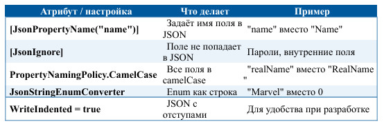
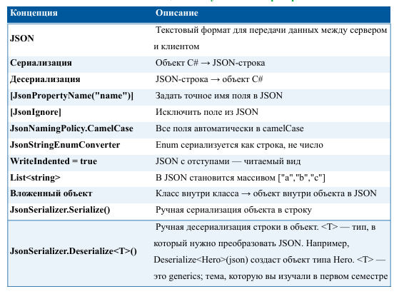

# Лабораторная работа №29. REST API: контроллеры и маршруты

P.S: НИ В КОЕМ СЛУЧАЕ ЭТА РАБОТА И ВСЕ ПОСЛЕДУЮЩИЕ И ПРЕДЫДУЩИЕ НЕ НАПИСАНЫ С ПОМОЩЬЮ GPT И ТОМУ ПОДОБНОЕ!!! (ну практически, кроме README.md)

## Основная информация

- **ФИО:** Тотьмянин Тихон Алексеевич

- **Группа:** ИСП-232

- **Дата:** 05.05.2026  

## Описание работы

В ходе лабораторной работы изучен формат JSON, настроена сериализация данных в ASP.NET Core, применены атрибуты для управления форматом JSON-ответов, рассмотрена работа с enum и вложенными объектами.

## Структура проекта

```
HeroesApi/
├── Controllers/
│   └── HeroesController.cs
├── Models/
│   └── Hero.cs
├── Data/
│   └── HeroesStore.cs
├── Properties/
│   └── launchSettings.json
├── Program.cs
└── HeroesApi.csproj
```

## Запуск

```bash
cd HeroesApi
dotnet restore
dotnet run
```

## Таблица атрибутов JSON



## Главные выводы

1. Сериализация и десериализация
Сериализация — это процесс преобразования объекта C# в JSON-строку для передачи по сети.
Десериализация — обратный процесс: преобразование JSON-строки обратно в объект C#.
Это необходимо, потому что сервер и клиент могут быть написаны на разных языках, а JSON — универсальный текстовый формат.

2. Зачем нужен [JsonIgnore]
Атрибут [JsonIgnore] полностью исключает поле из JSON-ответа.
Реальный пример:

- В базе данных есть поле PasswordHash или InternalNotes
- Мы не хотим показывать эти данные клиенту из соображений безопасности
- Добавляем [JsonIgnore] → поле не попадёт в ответ, даже если запросит

3. Почему enum лучше сериализовывать строкой
Числом (по умолчанию): "universe": 0 — непонятно, что означает 0
Строкой (с конвертером): "universe": "Marvel" — сразу ясно значение
Преимущества:

- Клиентский код читаемее
- Не нужно держать справочник соответствий чисел и значений
- При добавлении новых значений enum не ломается совместимость

4. Что изменилось после настройки CamelCase
До настройки:

```json
{
  "Id": 1,
  "Name": "Spider-Man",
  "RealName": "Peter Parker",
  "Universe": 0
}
```

После настройки:

```json
{
  "id": 1,
  "name": "Spider-Man",
  "realName": "Peter Parker",
  "universe": "Marvel"
}
```

Изменения:

- Все имена полей в camelCase (стандарт JSON/JavaScript)
- Enum отображается как строка, а не число
- JSON отформатирован с отступами для читаемости

## Итоговая таблица: что изучили в лабораторной


